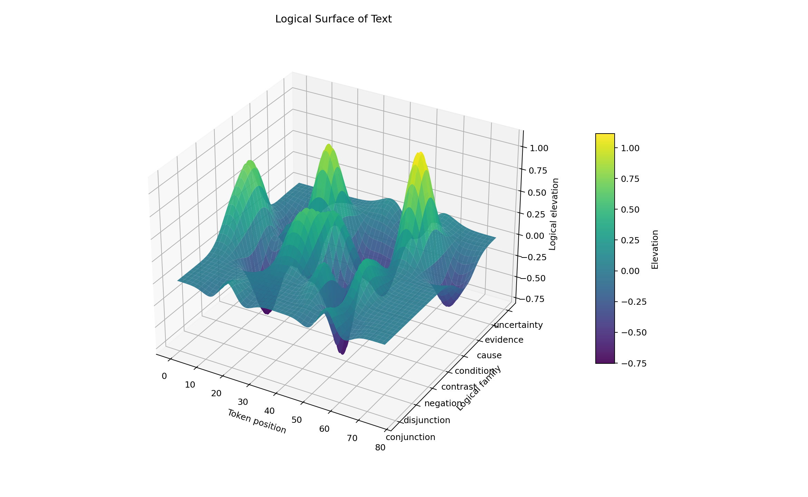
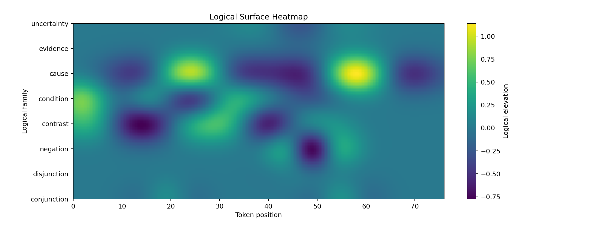

# Mathematical Interpretation of Logical Flow

An experiment in turning English text into a **3D logical surface** — a geometric object whose ridges, troughs, and gradients encode how the text reasons. The goal is to compare texts by their *logical shape* rather than by their words alone.

This repository contains **Stage 1: the toy model** — a self-contained Python script that demonstrates the core idea on a curated catalog of ~50 logical-operator phrases. It is intentionally small, hand-tuned, and inspectable; it is not a learned model.

## The idea in one minute

Texts contain logical operators — *and*, *or*, *not*, *but*, *if*, *because*, *for example*, *maybe*, … — that do work beyond their dictionary meaning. They join, branch, negate, contrast, condition, cause, illustrate, or soften.

Each operator is treated as a localized **wave** placed on a 2D grid:

- **X-axis** — position in the text (token index)
- **Y-axis** — the operator's *logical family* (8 families: conjunction, disjunction, negation, contrast, condition, cause, evidence, uncertainty)
- **Z-axis** — the wave height, summed across all detected operators

The wave shape is a **Mexican-hat (Ricker) wavelet** — a central peak with flanking troughs — so the resulting surface has structure beyond smooth bumps. Each operator carries a hand-tuned `(polarity, strength, width)` and is amplified or softened by nearby intensifiers (*very*, *clearly*) and hedges (*maybe*, *might*).

The result is a surface that can be plotted, measured, and compared.

## Example output

Running the demo on a short paragraph mixing conditions, causes, contrast, and hedges produces:

| 3D surface | Heatmap |
| :--- | :--- |
|  |  |

Yellow ridges along the *cause* row come from `therefore` / `because` / `consequently`. Dark troughs around *contrast* and *negation* come from `but` / `however` / `not`. The peak near token 0 on *condition* is the opening `If`.

Alongside the plots, the script prints:

- A table of detected operator events (phrase, family, token span, amplitude, context factor).
- Aggregate **surface metrics**: positive/negative wave mass, mean elevation, surface energy, gradient-magnitude roughness, and per-100-token densities for branching, contrast, causal inference, and uncertainty.

## Install and run

Requires Python ≥ 3.13 and [uv](https://docs.astral.sh/uv/).

```bash
uv sync
uv run logical_surface_model_v1.py        # Stage 1: operator-wave toy model
uv run logical_surface_model_v2.py        # Stage 2: + scope/relation fields
uv run logical_surface_model_v3.py        # Stage 3: + bounded scopes, confidence, energy normalization
```

By default each script runs the embedded sample text, prints its analysis, opens the matplotlib windows, **and writes a full run directory under `outputs/v{N}/runs/{run_id}/`** (see below). Close the matplotlib windows to let the process exit.

### CLI flags

All three versions share the same core flags:

| Flag | Default | Effect |
| :--- | :--- | :--- |
| `--text "…"` | — | Analyze the given string instead of the embedded sample. |
| `--file path.txt` | — | Analyze the UTF-8 contents of a file. |
| `--no-plots` | off | Skip opening matplotlib windows (still writes PNGs unless `--no-save`). |
| `--no-save` | off | Skip writing the run directory entirely. |
| `--output-dir PATH` | `./outputs` | Override the output root (run dir becomes `PATH/v{N}/runs/{run_id}/`). |
| `--run-id ID` | auto | Override the auto-generated run id (`YYYYMMDDTHHMMSSZ_<text-sha6>_<uuid4>`). |
| `--x-resolution N` | 240 (v1) / 280 (v2, v3) | Surface samples along the token axis. |
| `--y-resolution N` | 120 (v1) / 140 (v2, v3) | Surface samples along the logical-family axis. |

Version-specific knobs:

- **v1** — `--cross-family-width` (default `0.55`).
- **v2** — `--operator-cross-family-width` (default `0.55`), `--relation-cross-family-width` (default `0.75`).
- **v3** — `--operator-cross-family-width` (default `0.55`), `--relation-cross-family-width` (default `0.42`), `--max-relation-ratio` (default `1.25`, caps relation/operator field energy).

### Run directory layout

Every invocation produces a self-contained, reproducible run folder:

```
outputs/v{N}/runs/{run_id}/
├── params.json        # version, UTC timestamp, input SHA256 + preview, config values,
│                      # operator catalog signature, intensifier/hedge wordlists
├── input_text.txt     # the exact text analyzed
├── metrics.json       # every computed metric
└── *.png              # surface + heatmap renders (per-version filenames below)
```

PNG filenames per version:

- **v1** — `surface.png`, `heatmap.png`
- **v2** — `total_surface.png`, `total_heatmap.png`, `operator_heatmap.png`, `relation_heatmap.png`
- **v3** — same as v2 plus `relation_raw_heatmap.png` and `relation_normalized_heatmap.png`

### Using the module from Python

```python
from logical_surface_model_v3 import analyze_text

result = analyze_text(
    "If it rains, then the picnic is cancelled. However, ...",
    show_plots=False,                  # don't open matplotlib windows
    save=True,                         # still write outputs/v3/runs/{run_id}/
)
print(result["metrics"])
print(result["run_dir"])               # pathlib.Path of the run folder
```

## What's in here

```
logical_surface_model_v1.py    # Stage 1: operator waves on a token-position × family grid
logical_surface_model_v2.py    # Stage 2: + scope/relation fields and clause inference
logical_surface_model_v3.py    # Stage 3: + bounded scopes, confidence, energy normalization
pyproject.toml                 # dependencies (numpy, matplotlib) and Python pin
uv.lock                        # resolved environment
outputs/                       # auto-saved per-run folders (v{N}/runs/{run_id}/) plus example renders
JOURNAL.md                     # stage-by-stage research log
CLAUDE.md                      # implementation notes for working on the code with Claude Code
```

The operator catalog (`LOGICAL_OPERATORS` in each script) is the main knob — each entry's `polarity`, `strength`, and `width` shape the surface. Adding or retuning an operator is a one-line change.

## What this is and isn't

This is a **toy model** — a first stage. It is:

- **Hand-tuned**, not learned. Polarities and strengths reflect intuition, not data.
- **English-only** and surface-form-only. No parsing, no embeddings, no discourse model.
- **Order-insensitive within a family**. Two `but`s at different positions both place wavelets; they do not interact beyond linear sum.
- **A geometry experiment**, not a claim about how reasoning works.

Subsequent stages may replace the static catalog with learned operator embeddings, add inter-family coupling, or compare surfaces across texts (e.g. as a similarity metric over logical shape).

## License

Not yet specified.
