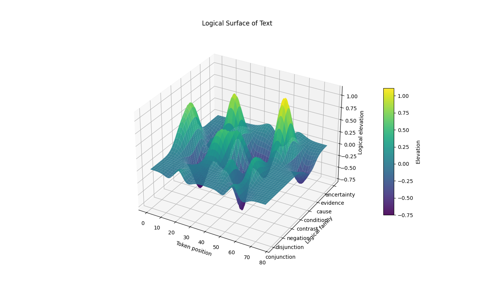
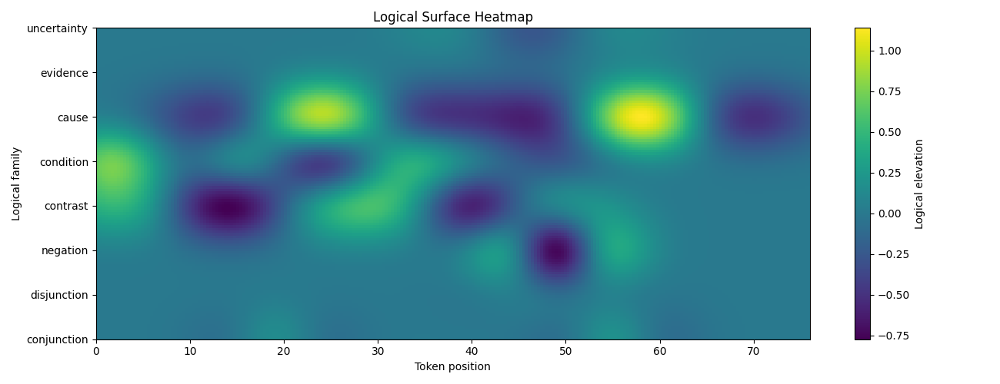

# Mathematical Interpretation of Logical Flow

An experiment in turning English text into a **3D logical surface** — a geometric object whose ridges, troughs, and gradients encode how the text reasons. The goal is to compare texts by their *logical shape* rather than by their words alone.

This repository contains **Stage 1: the toy model** — a self-contained Python script that demonstrates the core idea on a curated catalog of ~50 logical-operator phrases. It is intentionally small, hand-tuned, and inspectable; it is not a learned model.

## The idea in one minute

Texts contain logical operators — *and*, *or*, *not*, *but*, *if*, *because*, *for example*, *maybe*, … — that do work beyond their dictionary meaning. They join, branch, negate, contrast, condition, cause, illustrate, or soften.

Each operator is treated as a localized **wave** placed on a 2D grid:

- **X-axis** — position in the text (token index)
- **Y-axis** — the operator's *logical family* (8 families: conjunction, disjunction, negation, contrast, condition, cause, evidence, uncertainty)
- **Z-axis** — the wave height, summed across all detected operators

The wave shape is a **Mexican-hat (Ricker) wavelet** — a central peak with flanking troughs — so the resulting surface has structure beyond smooth bumps. Each operator carries a hand-tuned `(polarity, strength, width)` and is amplified or softened by nearby intensifiers (*very*, *clearly*) and hedges (*maybe*, *might*).

The result is a surface that can be plotted, measured, and compared.

## Example output

Running the demo on a short paragraph mixing conditions, causes, contrast, and hedges produces:

| 3D surface | Heatmap |
| :--- | :--- |
|  |  |

Yellow ridges along the *cause* row come from `therefore` / `because` / `consequently`. Dark troughs around *contrast* and *negation* come from `but` / `however` / `not`. The peak near token 0 on *condition* is the opening `If`.

Alongside the plots, the script prints:

- A table of detected operator events (phrase, family, token span, amplitude, context factor).
- Aggregate **surface metrics**: positive/negative wave mass, mean elevation, surface energy, gradient-magnitude roughness, and per-100-token densities for branching, contrast, causal inference, and uncertainty.

## Install and run

Requires Python ≥ 3.13 and [uv](https://docs.astral.sh/uv/).

```bash
uv sync
uv run main.py
```

The script runs the embedded `sample_text` and opens two matplotlib windows (3D surface, then heatmap). Close them to let the process exit.

To analyze your own text from a REPL or another script:

```python
from main import analyze_text

result = analyze_text("If it rains, then the picnic is cancelled. However, ...", show_plots=False)
print(result["metrics"])
```

## What's in here

```
main.py            # the entire model: catalog, tokenizer, matcher, surface builder, plots
pyproject.toml     # dependencies (numpy, matplotlib) and Python pin
uv.lock            # resolved environment
outputs/           # saved example renders
CLAUDE.md          # implementation notes for working on the code with Claude Code
```

The operator catalog (`LOGICAL_OPERATORS` in `main.py`) is the main knob — each entry's `polarity`, `strength`, and `width` shape the surface. Adding or retuning an operator is a one-line change.

## What this is and isn't

This is a **toy model** — a first stage. It is:

- **Hand-tuned**, not learned. Polarities and strengths reflect intuition, not data.
- **English-only** and surface-form-only. No parsing, no embeddings, no discourse model.
- **Order-insensitive within a family**. Two `but`s at different positions both place wavelets; they do not interact beyond linear sum.
- **A geometry experiment**, not a claim about how reasoning works.

Subsequent stages may replace the static catalog with learned operator embeddings, add inter-family coupling, or compare surfaces across texts (e.g. as a similarity metric over logical shape).

## License

Not yet specified.
